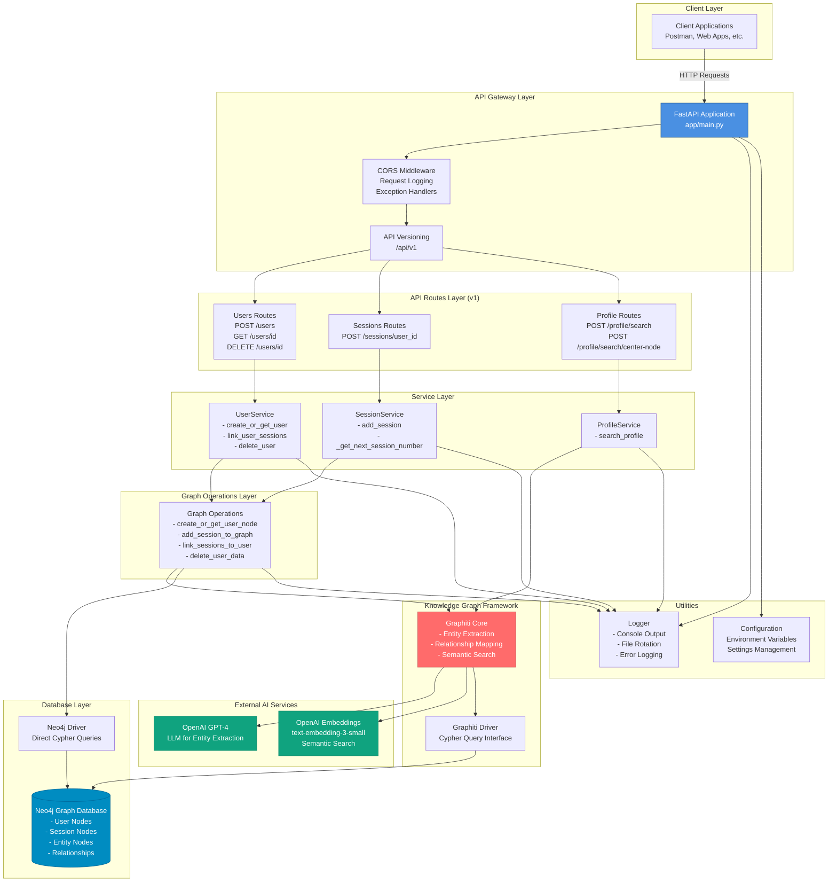
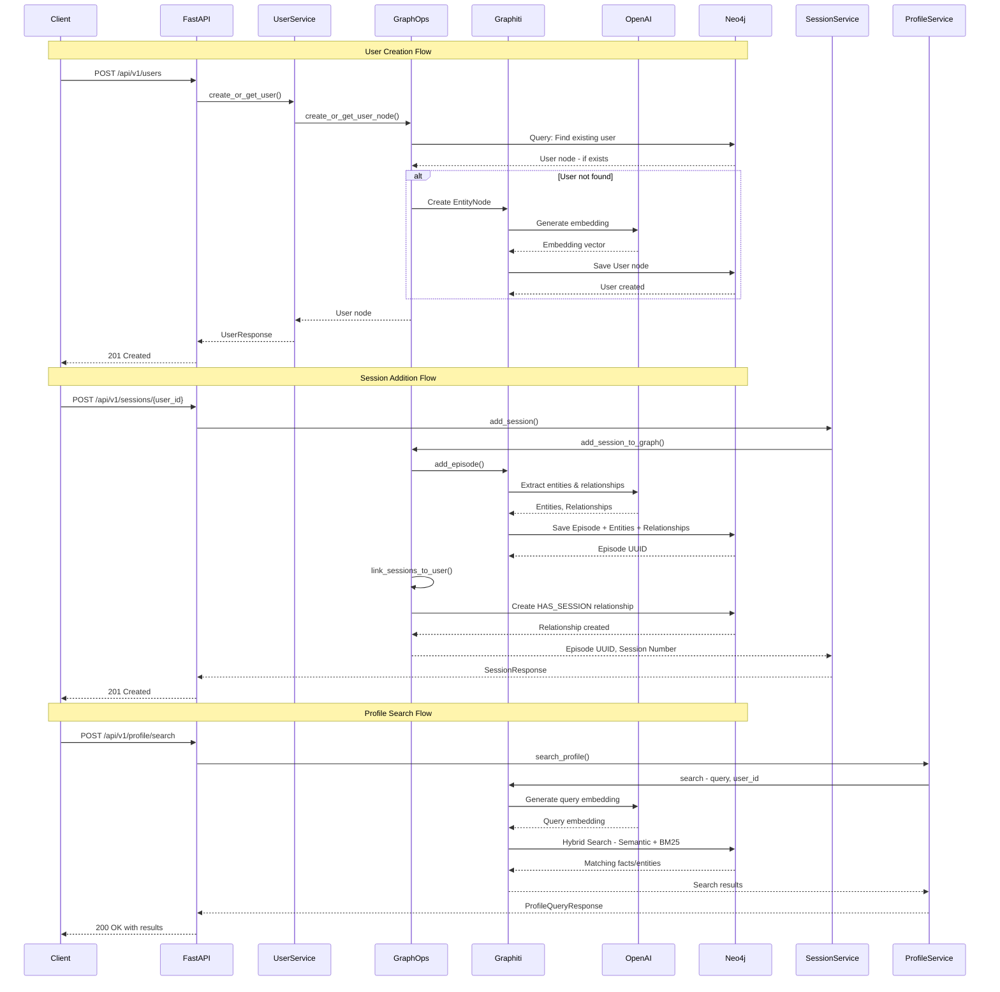
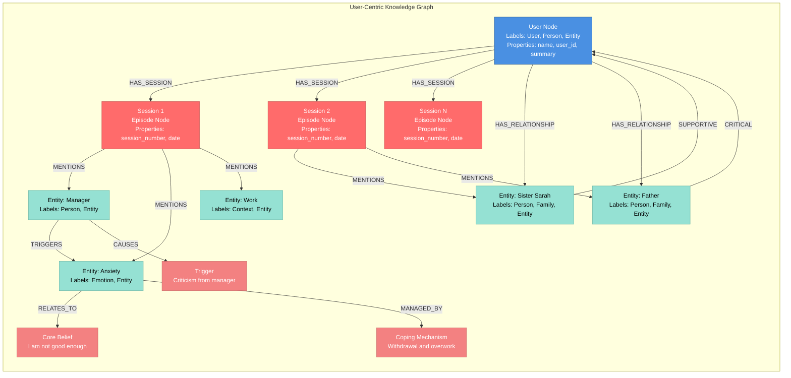
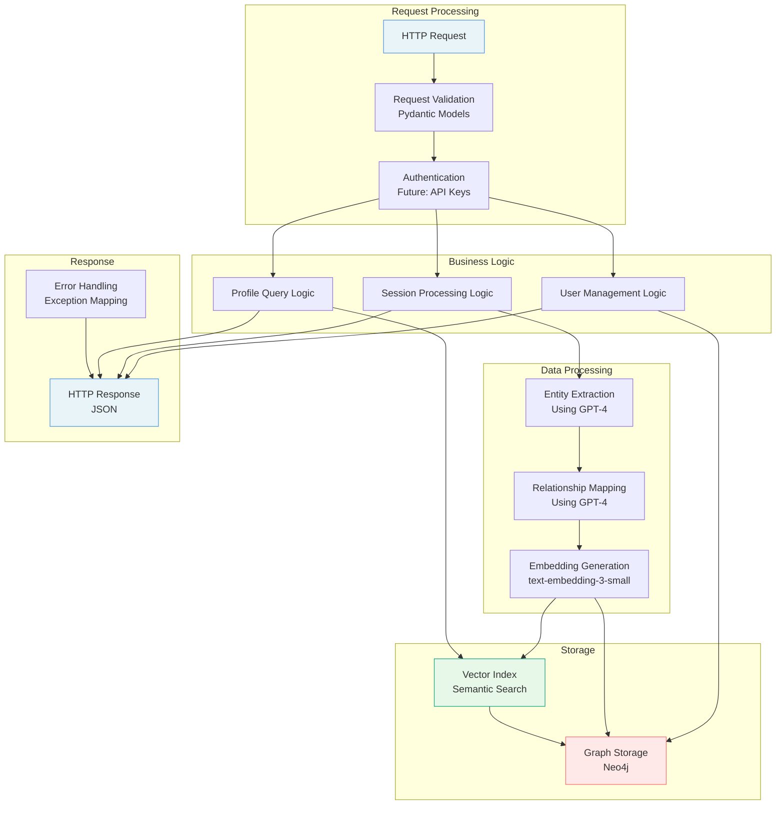
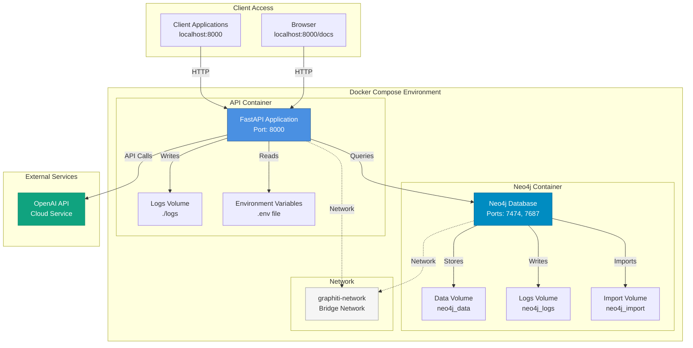

# Architecture Overview

**This document provides a comprehensive view of the Graphiti User Profile API architecture.**

## System Architecture Diagram

## Data Flow Diagram

## Knowledge Graph Structure

## Component Interaction Diagram

## Deployment Architecture

## Key Features

### 1. User-Centric Architecture

- All data is scoped to a user via `**group_id**`
- User node serves as the parent for all sessions and entities
- Enables multi-tenant isolation

### 2. Knowledge Graph Structure

- **User Node**: Central parent node
- **Session Nodes (Episodes)**: Therapy session summaries
- **Entity Nodes**: Extracted people, places, emotions, beliefs
- **Relationship Edges**: Connections between entities

### 3. AI-Powered Extraction

- **GPT-4**: Extracts entities and relationships from session summaries
- **Embeddings**: Enables semantic search across the knowledge graph
- **Hybrid Search**: Combines semantic (vector) and keyword (BM25) search

### 4. Therapeutic Profile Components

- **Personality Traits**: Inferred characteristics
- **Core Beliefs & Schemas**: Deep-seated beliefs
- **Relational Dynamics**: Key relationships
- **Triggers & Vulnerabilities**: Emotional triggers
- **Coping Mechanisms**: Strategies and strengths

### 5. API Design

- RESTful endpoints
- Versioned API (`/api/v1`)
- Comprehensive error handling
- Request/response logging
- Health check endpoints

### 6. Production Ready

- Docker containerization
- Environment-based configuration
- Centralized logging with rotation
- Graceful error handling
- Health checks

### 7. Technology Stack

- **Framework**: FastAPI (Python 3.12)
- **Database**: Neo4j 5.15 (Graph Database)
- **Knowledge Graph**: Graphiti Core
- **AI Services**: OpenAI (GPT-4, text-embedding-3-small)
- **Validation**: Pydantic
- **Deployment**: Docker & Docker Compose
- **Logging**: Python logging with rotation